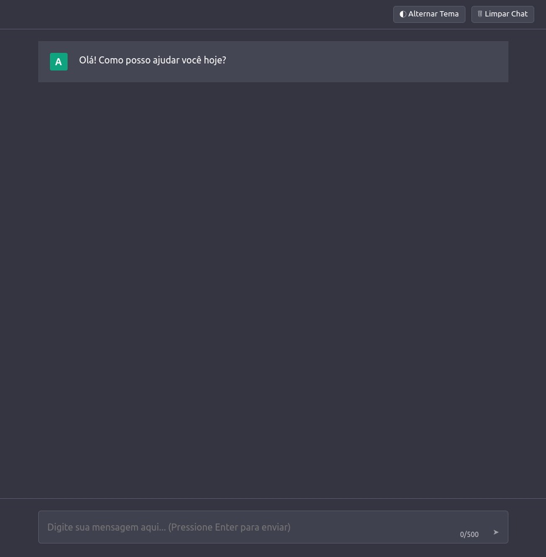

# Chat Interface

Uma interface de chat moderna e responsiva inspirada no ChatGPT, desenvolvida com HTML, CSS e JavaScript puros.



## 🚀 Características

- 💬 Interface moderna similar ao ChatGPT
- 🌓 Suporte a tema claro/escuro
- 📱 Design totalmente responsivo
- ⌨️ Área de texto expansível
- 🔄 Animações suaves
- 💾 Persistência do tema escolhido
- ⚡ Sem dependências externas

## 🛠️ Tecnologias Utilizadas

- HTML5
- CSS3 (com variáveis CSS)
- JavaScript (ES6+)

## 📋 Pré-requisitos

- Navegador web moderno
- Servidor web local (opcional)

## 🔧 Instalação

1. Clone o repositório:
```bash
git clone https://github.com/seu-usuario/chat-interface.git
```

2. Navegue até a pasta do projeto:
```bash
cd chat-interface
```

3. Abra o arquivo `index.html` em seu navegador ou use um servidor local.

## 💻 Uso

1. O chat inicia automaticamente com uma mensagem de boas-vindas
2. Digite sua mensagem no campo de texto
3. Envie pressionando Enter ou clicando no botão de envio
4. Use o botão de tema para alternar entre modo claro/escuro
5. Use o botão de limpar para reiniciar o chat

## ⚙️ Configuração da API

Para conectar com uma API de chat:

1. Localize a seção de configuração da API no arquivo `index.html`:
```javascript
const API_CONFIG = {
    url: 'sua-url-api-aqui',
    parameters: {
        temperature: 0.7,
        top_p: 0.9
    }
};
```

2. Substitua `'sua-url-api-aqui'` pela URL da sua API
3. Ajuste os parâmetros conforme necessário

## 🎨 Personalização

### Cores
As cores podem ser personalizadas através das variáveis CSS no início do arquivo:

```css
:root {
    --bg-primary: #343541;
    --bg-secondary: #444654;
    --text-primary: #FFFFFF;
    /* ... outras variáveis ... */
}
```

### Temas
O tema claro pode ser personalizado modificando as variáveis em:

```css
[data-theme="light"] {
    --bg-primary: #FFFFFF;
    --bg-secondary: #F7F7F8;
    /* ... outras variáveis ... */
}
```

## 📝 Recursos Adicionais

- Contador de caracteres
- Indicador de digitação
- Tratamento de erros
- Mensagens com animação
- Suporte a múltiplas linhas
- Scroll automático

## 🤝 Contribuindo

1. Faça um Fork do projeto
2. Crie uma Branch para sua Feature (`git checkout -b feature/AmazingFeature`)
3. Commit suas mudanças (`git commit -m 'Add some AmazingFeature'`)
4. Push para a Branch (`git push origin feature/AmazingFeature`)
5. Abra um Pull Request

## 📜 Licença

Este projeto está sob a licença MIT. Veja o arquivo [LICENSE](LICENSE) para mais detalhes.

## 👤 Autor

Seu Nome
- GitHub: [@seu-usuario](https://github.com/seu-usuario)
- LinkedIn: [@seu-linkedin](https://linkedin.com/in/seu-linkedin)

## 🙏 Agradecimentos

- Inspirado no design do ChatGPT
- Ícones por [Feather Icons](https://feathericons.com/)
